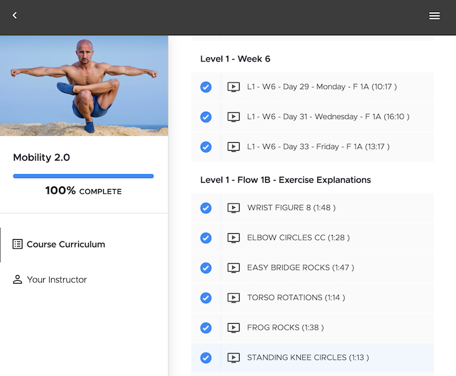
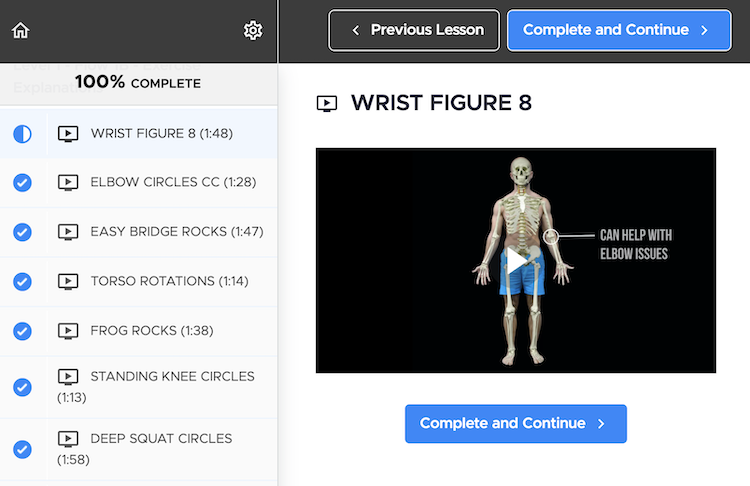
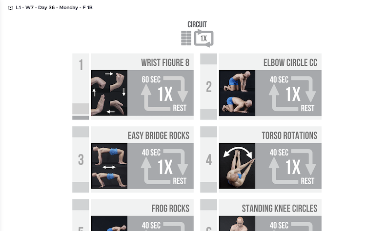
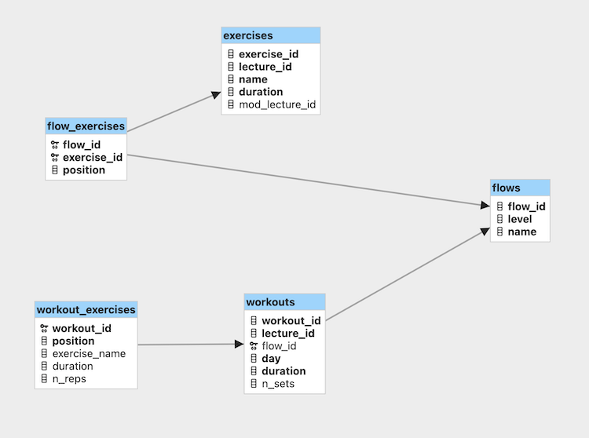
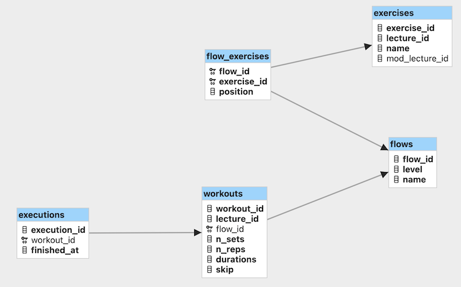

# Cali Move UI 2

## Cali Move
Cali Move is a platform with programs to improve mobility, Calisthenics skills and strengh. A program I frequently use is _Mobility 2.0_.

The curriculum tells you which workout to do on which days. A workout is specified by the following things:

* a _flow_: a fixed sequence of _exercises_.
* the number of _sets_, i.e. how often to repeat the flow.
* the _duration per exercise_, i.e. how long to do each exercise.
* the number of _repetitions_, i.e. how often to repeat an exercise for the given duration.

The UI is okay but for me some things are difficult or even impossible to do:
* during a workout skip or restart an exercise.
* the workout only has a timer when watching a follow along video. So this doesn't work nicely on a small bandwidth or without an internet connection.
* keeping track of your training.
* choosing a different duration for a specific flow.
* easily access the explanation of an exercise.
* overall the UI is a bit clumsy to navigate.

This motivated me to create a UI for _Cali Move: Mobility 2.0_ that improves on these issues.

## Scraping
First scrape the curriculum page to find all flows, exercise explanations and workouts of the program. Then scrape all relevant lectures in the curriculum.

The curriculum consists of:

* flows which explain the exercises,
* modifications whichh explain modifications of the exercises,
* workouts and
* other things that aren't relevant.

### Data Model

### Process
Using the _requests_ and _Beautiful Soup_ packages scrape the curriculum and its lectures. Then, using _easyocr_ extract data from images, fix some OCR and some data issues. Finally, prepare the data, check it for consistency and insert into the production data model.

1. Scrape the curriculum
   * extract the flows:
     * `level` and `name`
     * the `position`, `lecture_id`, `name` and `duration` of its exercises
   * extract the modifications
     * the `lecture_id` and `name`
     * the modifications are matched by name to the exercises
   * extract the workouts
     * the `lecture_id` and `day`
     * the `level` and `name` of its flow
     * the workout image that contains the number of sets (`n_sets`) of the flow
     * the exercise images that contain `position`, `name`, `duration`, `n_reps` of the exercise
2. Extract data from workout images
   * parse `name`, `duration` and `n_reps` of each exercise image
     * fix incorrectly parsed exercise names and `n_reps`
   * parse `n_sets` from the workout image
   * extract a preview image for each exercise
   * match exercises in the workouts to exercises in the flows
3. Fill the production data base

As it turns out in each workout the number of repetitions is the same for each exercise. This allows to simplify the app data model a bit.

## Data Model

## App

The app is pretty simple and only has a couple of screens:

* Exercises Overview
  * list of all exercises, displayed as cards
    * name
    * image
    * link to explanation video & modifications video
    * chips in which flows this exercise exists
  * the exercises are sorted alphabetically
  * can be searched by name
  * can be filtered by level and flow

* Flows Overview
  * list of flows
    * list of exercises in a flow, displayed as cards
    * sorted by their position in the flow
  * flows sorted by level and name
  
* Flow details
  * list of exercises in this flow, displayed as cards
  * sorted by their position in the flow
  * selection of workouts based on this flow
  * button to start a selected workout

* Workout
  * name, image, and links of an exercise
  * countdown timer
  * indicator what to do currently: rest, get ready, workout, finished
  * buttons to go to previous/next repetition, play/pause
  * button to log a workout

* Log
  * statistics and plots about executed workouts

## API

As the screens are pretty simple basically every screen can be mapped to an endpoint:

* `/exercises`: All Exercises + Flows
* `/flows`: All Flows + Exercises 
* `/flows/{flow_id}`: Specific Flow + Exercises + Workouts
* `/flows/next`: Next Flow to practice
* `/workouts/{workout_id}`: Specific Workout + Flow + Exercises
* `/executions`

## Hosting

The frontend is hosted on _Vercel_. It is easy to setup, free for small apps and you only need to push to GitHub for deploying.

The backend is hosted using the AWS services _EC2_, _API-Gateway_, and an SQLite Database stored on an _EBS_. Using a Server database like Postgres would be easier but relatively expensive for such a tiny hobby project. Using AWS services made sense as they are very cheap with the free tier, I have some experience and they are most widely used.
